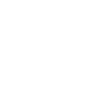

# OrbitPOInts
Visualize Orbital Points of Interest in the Tracking Station and Mapview

[Space Dock](https://spacedock.info/mod/3466/OrbitPOInts)

## Features
Points of Interest:
- HillSphere
- Sphere of Influence
- Atmosphere
- Min Orbit
- Max Altitude (Ability to Hide Max Altitude on Atmospheric Bodies)

## Known Issues
See https://github.com/StrikeForceZero/KSP-OrbitPOInts/labels/bug for known issues.

## Planned/TODO/PRs Welcome!
- [~~Submit to CKAN!~~](https://github.com/KSP-CKAN/NetKAN/blob/master/NetKAN/OrbitPOInts.netkan)
- ~~Custom colors~~
- ~~Custom POIs ("I want to visualize a 500km ring around a body")~~
    - Allow any number of custom POIs
- Rewrite the mess OrbitPoiVisualizer has become.
- High resolution max altitude detection for current orbit to warn user if they are at risk of impact
- Show POI for High/Low Orbit and potentially other science related altitudes
- Persistent Settings

## Screenshots

